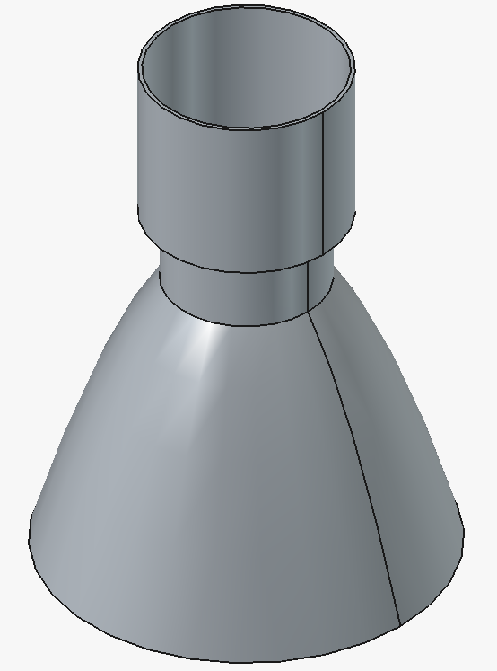

# Liquid-Rocket-Engines-Design-Journey

# Open-Source Rocket Engine Design Journey 🚀

Welcome! This repository is dedicated to my self-taught journey into aerospace engineering and 3D modeling, started **before** entering my Mechanical Engineering bachelor's degree.

## 🎯 The Goal
The objective here is NOT to build a flight-ready engine (yet!), but to master CAD tools (FreeCAD), understand geometric layouts, and document my evolution from absolute zero. 

## 🛠️ Current Project: Path-Finder

* **Software used:** FreeCAD (Part Design)
* **Status:** Conceptual / Geometric study (uncalculated)
* **Focus:** Learning 3D revolutions, constraints, and assembly.
